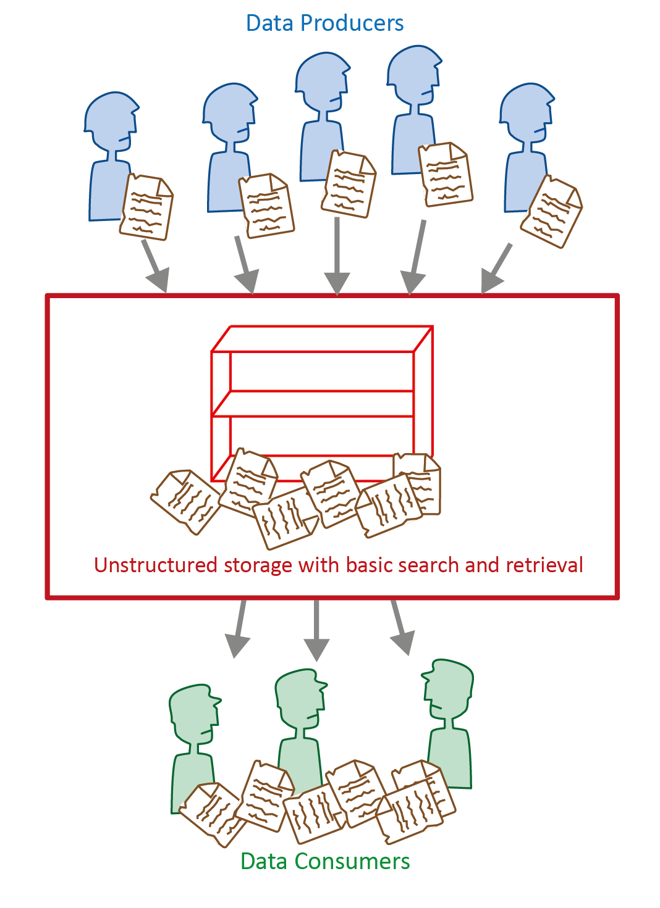
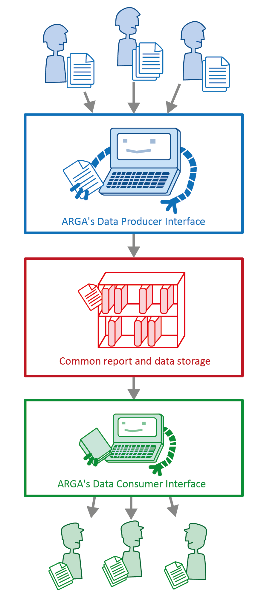
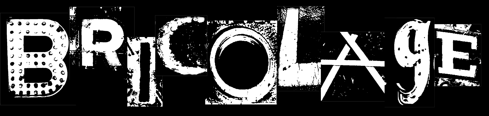

# Adaptive Report Generation Assistant - ARGA

## The Project

ARGA is being funded through the [Defence and Security Accelerator](https://www.gov.uk/government/organisations/defence-and-security-accelerator) under the [‘Revolutionise the Human Information Relationship for Defence’](https://www.gov.uk/government/publications/accelerator-themed-competition-revolutionise-the-human-information-relationship-for-defence) call.  It aims to solve the information management and analysis problems stemming from the use of unstructured natural language text. Phase 1 of ARGA’s development will be completed in December 2017. The project team are keen to gather information and ideas to help shape its thinking about Phase 2 developments, so please get in touch using the provided contact details below if you have any thoughts you would like to share.

## What does ARGA do?

Across the whole of Defence, large amounts of text data are routinely produced in an unstructured format, limiting data retrieval and impeding optimal decision-making. ARGA seeks to reduce the burden this creates at source by intelligently assisting authors to apply meaningful structure to text as they write, ultimately creating an adaptive information bridge between data producers and data consumers.

|  |  |
| Before: Text document organisational structure is not linked to their meaning and content | With ARGA: Text documents are organised based on what they represent |

## Why is ARGA novel?

ARGA focuses on tackling difficult open problems, such as: word/phrase prediction;  reconciliation of alternative spellings; word-sense disambiguation; corpus-wide co-reference for entities; automated relationship and event extraction; and the development of self-learning ontologies. Unlike most current attempts to solve these problems, ARGA focuses the ML effort on the report generation stage, rather than waiting until the report has been submitted or an entire corpus created. As such, it facilitates true **human-machine teaming**, so that data producers and ARGA become co-authors of a report.

## Future plans for ARGA

ARGA is designed to become a key tool within an integrated information environment. It has the potential to enhance the structure of text data for a wide range of systems used in a variety of defence tasks. Phase 2 will focus on increasing ARGA’s capability and enabling it to interact with other systems, either by providing structured text data or by consuming specialised datasets to improve its ability to learn. We are therefore interested to discuss collaboration with other project teams in order to explore potential integrated tools.

## The project team

|  |  |  |
| --- | --- | --- |
| Aleph Insights is a London-based analytical consultancy that was founded in 2014. The company specialises in supporting strategic decision-making in business and industry, as well as in defence, security, intelligence and international affairs. | Bricolage offers specialised qualitative and quantitative data analysis and research solutions. We have expertise in creating bespoke ontologies for NLP and ML tasks and in using text analytics tools on large unstructured datasets from diverse sources to discover additional insights and new knowledge. | Committed software are ex-mathematicians looking for real world problems to solve. With 15 years experience in creating bespoke software we've built everything from small tools to cloud based enterprise applications. |

## Contact

If you have any thoughts about the future development of ARGA please get in contact directly with [Peter Coghill](https://www.linkedin.com/in/coghill/) from the project team [peter@alephinsights.com](mailto:peter@alephinsights.com?Subject=ARGA). We are particularly interested in any input relating to potential use cases or relevant test environments. We look forward to hearing from you.
